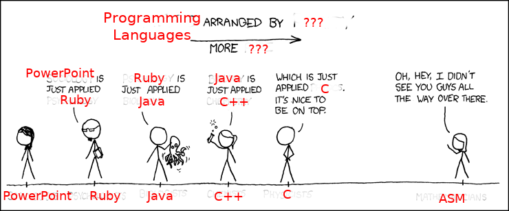

# `whoami(1)`

- - -

Katharina Fey ( `@spacekookie` )

* Software Engineer from Berlin
* Works with Rust at Ferrous Systems

- - -

* Member of Community Team and `cli-wg`
* Creating a `database-wg`
* Developing and maintaining Rust tools
* Giving workshops and organising meetups
  * https://berline.rs

- - -

If you have questions beyond this workshop:

* E-Mail: kookie@spacekookie.de
  * GPG: `555F 2E4B 6F87 F91A 4110`
* XMPP: `kookie@spacekookie.de`
* Twitter: `@spacekookie`


# What is Rust?

- - -

* Originally {developed, funded} by Mozilla
* Replacement for `C++` in Firefox
  * Replace individual components gradually
  * Fundamentally built around good FFI
* Developed by a large community world-wide

- - -

(We won't cover FFI today)

- - -

* Influences from C++ and Haskell

- - -

## Spectrum of Programming languages



- - -

## Some highlights

* Memory safety without GC
* Thread safety without Runtime
* "Zero cost abstractions"
* Utilises static analysis heavily

- - - 

> Rust is a rather German programming language:
>
> It's very precise and has no sense of humour


# Installation

- - -

* https://rustup.rs

Use whatever editor you're comfy with

- - -

## Test setup

* Type `"cargo new <name>"`
* Folder should contain `Cargo.toml` and `src/main.rs`
* Running `"cargo run"` should print "Hello world!"

```rust
fn main() {
    println!("Hello world");
}
```

- - -

## Debug printing

* `"println!"` is a macro (marked by "!")
* `"{}"` is used for string interpolation
  * Different formatters can be used:
    * `"{:?}"` debug format
    * `"{:#?}"` pretty debug format
    * `"{:X}"` upper-case hexadecimal numbers
    * ... many more in the docs!

- - -

https://play.rust-lang.org


# Slides

- - -

* https://github.com/spacekookie/one-day-rust
* Contains some example code too
* PRs welcome!


# Basics

- - - 

## There's no null

- - -

## 🎉

- - -

## Basic Types

* Primitives
  * `u8`, `u16`, `u32`, `u64`, `u128`
  * `i8`, `i16`, ...
  * `f32`, `f64`, ...
  * `bool`, `char`, `usize`, `isize`
* Tuples i.e. `(5, false, 'c')`
* `()` = Unit/ void

- - -

## Slices 🥧

* i.e. `[1, 2, 3, 4]`
* Essentially arrays
* Exist on Stack or Heap
* Don't grow or shrink

- - -

## Strings

* `String` vs `&str`
* Heap allocated/ growable vs char-array
* Both `utf-8` enforcing!
* Turn one into the other
  * `to_string()`
  * `into()`

- - -

## libstd types

* `Vec` a growable vector
* `HashMap`, `HashSet`, `VecDeque`, ...

- - -

## Functions

```rust
fn square(x: i32) -> i64 {
	x * x
}
```

* Last line without a `;` implicitly returns
  * `return` keyword still exists for ambigous cases

- - -

## Mutability

* Variable bindings are by default immutable
  * `mut` keyword exists
  
```rust
let x = 5;
// x = 6; // this will fail!

let mut y = 5;
y = 6; // this is fine!
```

* Lints against useless `mut`

- - -

## Enums

* Similar to algebraic data types in Haskell
* Variants not first-class types (yet!)

```rust
enum Action {
  Nothing,
  Move { x: i64, y: i64 }, // Structure enum
  Attack(Unit),            // Tuple enum
}
```

- - -

Use pattern-matching to distinguish variants

```rust
match act {
  Nothing => println!("Nice day to just look around"),
  Move { x, y } => move_to(x, y),
  Attack(trg) => attack(trg),
}
```

# Speaking of enums

- - - 

## Option & Result

* Two enums provided by `libstd`/`libcore`
* Used for _really_ cool error handling

```rust
fn can_fail(fails: bool) -> Option<&str> {
    if !fails {
        Some("Cool")
    } else {
        None
    }
}
```

- - -

```rust
fn can_fail(fails: bool) -> Result<&str, &str> {
	if !fails {
		Ok("Cool")
	} else {
		Err("You were setting up for failure!")
	}
}
```

- - - 

* `Option` represents a possible missing value.
* Use `unwrap()` to access data
  * Panics if value doesn't exist
  * `?` operator can gracefully handle errors

```rust
let x = Some("Cool");
println!("{}", x.expect("Value missing!"));
```

- - -

You can also use pattern matchin to access data

```rust
let x = can_fail(false);
match x {
    Some(val) => println!("{}", val),
    None => println!("<missing>"),
}
```

- - -

```rust
fn do_stuff() -> Result<(), MyError> {
    let x = can_fail()?;
    
    // ... is the same as ...

    let y = match can_fail() {
        Ok(y) => y,
        Err(e) => return Err(e),
    };
}
```


# Example Time!

- - -

* Get comfortable writing Rust
* Use stuff covered so far

- - -

## Write a small parser

* Protocol to publish and retrieve
  * `PUB <item>, <item>`
  * `GET <number>`
* Parse String into Enum
* Handle parse errors

- - -

```rust
enum Command {
    Pub(Vec<String>),
    Get(u32),
}

enum ParseError { /* ... */ }

fn parse(input: &str) -> Result<Command, ParseError> {}
```


# Structures & OO

- - - 

* Rust has some features that might look like object-orientation
* Rust is OO, depending on who you ask
  * Depends on if this person likes OO or not

- - - 

## Rust _doesn't_ have

* Inheritance
* Polymorphism
* Runtime generics

- - - 

## Rust _does_ have

* Monomorphic generics
* Interfaces (via "Traits")
* Trait inheritance (usually called "trait bounds")
* Associative functions

- - - 

## Is Rust object-oriented?

- - - 

## 🤷

- - - 

## `structs`

* Analogue to a `struct` in C or C++

```rust
struct MyType {
  num: u32,
  name: String,
}
```

- - - 

```rust
struct GenericStruct<T> {
    thing: T
}
```

- - -

## Associative functions

```rust
struct MyType;

impl MyType {
    fn new() -> Self {
        Self
    }
}

fn main() {
    let t = MyType::new();
}
```

- - - 

## Mutability & self

```rust
struct Person { name: String, age: u8 }

impl Person {
    fn new() -> Self {
        Self { name: "Katharina".into(), age: 26 }
    }
    fn birthday(&mut self) { self.age += 1; }    
    fn age(&self) -> u8 { self.age }
}

// ...

let mut kat = Person::new();
kat.birthday(); // `&mut self` is implicit
```

- - - 

## Interfaces & Traits

* Interface types are called "Traits"
* A type can implement an arbitrary number of these
* Some special rules (orphan rules) apply

```rust
trait Printable: Debug {
    fn print(&self);
}
```

- - -

```rust
use std::ops::Drop;

struct NativeCtx(const *ptr);

// `fn drop` becomes associated with `NativeCtx`
impl Drop for NativeCtx {
    fn drop(&mut self) {
        unsafe {
            native_thing_close(self.0);
        }
    }
}
```

- - - 

## In summary

* Rust has some object-oriented features
* `fn new()` is constructor by convention only
* Mutability encoded in function signatures


# Ownership & Borrowing

- - -

## What is memory safety?

- - -

* Use after free
* Double free

Leaking memory is fine™

- - -

Fundamental question:

* "Who" owns data?
* ... and cleans it up?!

- - -

## Ownership

* In Rust all data has an owner

```rust
struct MyStruct;
fn do_something(_: MyStruct);

let x = MyStruct; // I own `x`

do_something(x); // I give `x` away

do_something(x); // This won't _compile_!
```

- - -

```
error[E0382]: use of moved value: `x`
 --> main.rs:8:18
  |
6 |     do_something(x);
  |                  - value moved here
7 | 
8 |     do_something(x);
  |                  ^ value used here after move
  |
  = note: move occurs because `x` has type `MyStruct`, which does not implement the `Copy` trait

error: aborting due to previous error
```

- - -

* Always and _only_ one owner to data
  * Responsible for freeing memory

- - -

### Question: that sucks

```rust
fn does_something(data: MyStruct) -> MyStruct {
    // Important scientific computing
	data
}
```

(that's not a question, really)

- - - 

## Two solutions

- - - 

## Copy & Clone

- - - 

## Two traits in libcore

* Copy = `memcpy`
* Clone = Deep copy

- - - 

```rust
fn thing(_: u8) {}

let x = 5;
thing(x); // {Integer} is `Copy`
thing(x); // This works
```

- - - 

```rust
#[derive(Clone)] // <-- Macro that provides `Clone`
struct NotCopy {
    name: String
}

fn thing(_: NotCopy) {}
let x: String = "No Strings attached";

thing(x.clone());
thing(x);
```

* `Clone` allows pre-emptive copying of data
  * In reality LLVM can optimise many of these
  * `Clone` can be "derived" for a type if all members are also `Clone`

- - -

## Borrowing

- - -

* If you own something, you can lend it 
* Data can be shared without moving ownership!
* Under the hood: pointers!

- - -

```rust
let x = MyStruct; // ˯ Pretzel operator means "borrow"
fn do_something(foo: &MyStruct) { }

do_something(&x);
do_something(&x); // This is fine
```

- - -

* Borrowing is encoded at the type-level
* `MyStruct` and `&MyStruct` are fundamentally different types!

- - - 

## Mutability

* When borrowing data, mutability is **exclusive**
* No two `&mut` can exist for the same data twice.

- - - 

## Borrowing Rules

As many read-only borrows as you want

OR

One (1) `&mut` borrow

- - - 

## why

- - - 

* Multiple sources of errors that can be avoided at compile time
* Usually Ownership/ Borrowing mechanisms an be caught by patterns manually
* By letting the compiler enforce them there is less cognitive load

- - - 

## 🔥 Examples 🔥

- - -

Should this compile?

```rust
let mut f = File::open("foo.txt)?;

thread::spawn(|| {
    let mut buf = vec![];
    f.read_exact(&mut buf).unwrap();
})
```

- - -

No!

```
error[E0373]: closure may outlive the current function, but it borrows `f`, which is owned by the current function
  --> main.rs:8:19
   |
8  |     thread::spawn(|| {
   |                   ^^ may outlive borrowed value `f`
9  |         let mut buf = vec![];
10 |         f.read_to_end(&mut buf).unwrap();
   |         - `f` is borrowed here
help: to force the closure to take ownership of `f` (and any other referenced variables), use the `move` keyword
   |
8  |     thread::spawn(move || {
   |                   ^^^^^^^
```

- - - 

```rust
let mut f = File::open("foo.txt)?;

thread::spawn(move || {
    let mut buf = vec![];
    f.read_exact(&mut buf).unwrap();
})
```

- - -

Should this compile?

```rust
let mut f = File::open("foo.txt")?;

for _ in 0..3 {
    thread::spawn(|| {
        let mut buf = vec![];
        f.read_exact(&mut buf).unwrap();
    });
}
```

- - - 

No (not even if we move!)

```
error[E0382]: capture of moved value: `f`
  --> main.rs:11:13
   |
9  |         thread::spawn(move || {
   |                       ------- value moved (into closure) here
10 |             let mut buf = vec![];
11 |             f.read_to_end(&mut buf).unwrap();
   |             ^ value captured here after move
   |
   = note: move occurs because `f` has type `std::fs::File`, which does not implement `Copy` 
```


# The 🐘 in the room

- - - 

* "Lifetimes" are mentioned in error messages
* The lifetime of data is an explicit concept in Rust

TLDR:

```rust
struct Wrap<'outer> {
    name: &'outer str
}
```

We won't cover this it more detail here!


# Iterators

* Rust has amazing iterators
* Example of a "zero cost abstraction"
  * They "disappear" at compile-time

- - -

## Iterator API

* Rust iterators are lazy

```rust
let list: Vec<_> = (0..)
    .take(1024)
    .map(|i| i * i)
    .collect();
```

- - -

Infinite iterators

```rust
use std::net::TcpListener;

let listener = // ...
for stream in listener.incoming() {
    // ... do stuff with Stream
}
```


# Example Time 2!

- - -

* Expand on the earlier example
* Add an actual server to it
  * Hint: `std::net::{TcpListener, TcpStream};

```rust
fn main() {
    let mut data = VecDeque::new();
    
    // - accept TCP connections
    // - Read incoming data to String
    // - Call `parse` function with String
    // - Send back data or error
```


# Modules and crates 📦

- - -

* Programs rarely remain simple enough for one file
* Breaking code out into multiple files is important
* Libraries in Rust are called "crates"
  * https://crates.io package index

- - -

## Modules

* Modules are either files or folders with a name
* Folders need an "entry" file
* Either `foo.rs` or `foo/mod.rs` can create the "foo" module

```rust
mod foo; // Load "foo" into compilation

use foo::Foo; // include things from "foo" module
```

- - -

```
.
├── foo
│   ├── bar.rs
│   └── mod.rs // Either this
├── foo.rs     // or this, but not both!
└── main.rs
```

- - -

## Crates

* A binary "crate" starts with `main.rs`
* A library crate starts with `lib.rs`

- - -

## Dependencies

Project files written in TOML

<small>Neither obvious nor minimal</small>

```toml
[package]
name = "badredis"
version = "0.1.0" 
authors = ["Katharina Fey <kookie@spacekookie.de>"]
edition = "2018"

[dependencies]
rocket = "0.4"
serde = { version = "1.0", features = ["derive"] }
serde_json = "1.0"
```

## Tests

* Cargo has a testing framework built-in
* `src/tests/` are unit tests
* `tests/` are integration tests
* Or mark functions with `"#[test]"`

```
 ❤ (azedes) ~/P/a/parse> cargo test
 Compiling parse v0.1.0 (/.../accu-workshop/parse)
    Finished dev [unoptimized + debuginfo] target(s) in 0.52s
     Running target/debug/deps/parse-21fa3580bcb761eb

running 1 test
test basic_function ... ok

test result: ok. 1 passed; 0 failed;
```


# Advanced subjects 🐉

- - -

* Concurrency with "Send" and "Sync" traits
* Async server programming
* "Unsafe" sub-language
* FFI and "native" calls
* Declarative Macros
* Procedural Macros/ Compiler attributes

- - -

## Send & Sync

* Describes if a type is thread-safe
* Used as a marker trait
  * Implementation is empty - compiler trusts Developer
  * This is however "unsafe"
  
```rust
unsafe impl Send for MyDataStructure {}
```

- - -

## Async server programming

* Future and Poll types in libstd/libcore
* `"futures.rs"` crate provides zero cost abstraction combinators
* async/await syntax not stabilised yet, but in the final stages of implementation
* Currently requires nightly Rust

```rust
//     Signature expands to `Future<Item=Result<String, io::Error>>`
async fn things_with_io() -> Result<String, io::Error> { /* ... */ }

let string = await!(things_with_io)?;
```

- - -

## Unsafe sublanguage

* Some things are impossible in safe rust
  * Writing many datastructures included
* "unsafe" allows circumvention of rules
  * Change mutability of a type
  * Access global shared state
  * Dereference raw pointers
  
```rust
#[allow(mutable_transmutes)] // This is always a bad idea!
fn fun(t: &Thing) {
    let t2: &mut Thing = unsafe { std::mem::transmute(t) };
}
```

- - -

## Foreign Function Interfaces

* Rust ABI is unstable
* Interfacing with foreign code is done via "C" (platform) ABI

```rust
use std::ffi::{c_void, c_uint};

extern "C" fn call_this_from_c(raw: *cost c_void) {
    // ...
}

extern "C" {
    fn call_this_from_rust(num: c_uint);
}

unsafe { call_this_from_rust(42) };
```

- - -

## Declarative Macros

* Opererate on a given AST
* Always expand to valid code
* Hygenic and pure

```rust
macro_rules! vec {
    ( $( $x:expr ),* ) => {
        {
            let mut temp_vec = Vec::new();
            $(
                temp_vec.push($x);
            )*
            temp_vec
        }
    };
}
```

- - -

## Procedural Macros

* Second type of macros that run inside the compiler
* Execute code to generate code at compile-time
* Example: `"#[derive(Clone)]"`
* You can do cool things with this!

Shameless plug: [thunder.rs](https://github.com/rust-cli/thunder)


# Questions? 😅


- - -

## Katharina Fey

* Works at [Ferrous Systems](https://ferrous-systems.com)
* Get in touch: [kookie@spacekookie.de](mailto:kookie@spacekookie.de)
* Twitter: [\@spacekookie](https://twitter.com/spacekookie) 
* GPG: 555F 2E4B 6F87 F91A 4110
